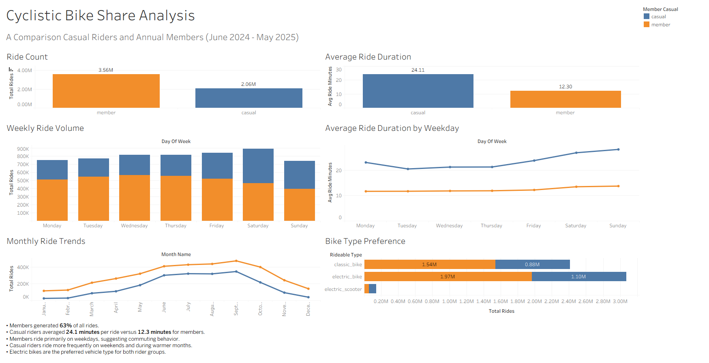

# Cyclistic Bike Share Analysis

An end-to-end data analysis examining how casual riders and annual members use Cyclistic's bike-share service differently.

## Project Overview

This project analyzes 12 months of Cyclistic bike-share trip data to identify differences in riding behavior between casual riders and annual members. The goal is to uncover patterns that can help inform strategies for converting casual riders into annual members.

The analysis follows a complete data workflow, including data preparation with Python, data storage and analysis in PostgreSQL using SQL, and visualization in Tableau.

## Business Question

**How do annual members and casual riders use Cyclistic bikes differently?**

Understanding these behavioral differences can help Cyclistic identify opportunities to encourage casual riders to become annual members.

## Tools & Technologies

- **Python** - Combined 12 months of trip data into a single dataset
- **PostgreSQL** - Stored and managed the combined dataset
- **SQL** - Cleaned, transformed, and analyzed ride data
- **Tableau** - Created the final interactive dashboard and visualizations

## Dataset

The analysis uses 12 months of historical Cyclistic trip data covering **June 2024 through May 2025**. The individual monthly datasets contain ride-level information including rider type, bike type, trip start and end times, station information, and geographic coordinates.

The monthly files were combined into a single dataset containing approximately **5.6 million rides** for analysis.

The source data is publicly available through [Divvy's historical trip data](https://divvybikes.com/system-data).

## Data Preparation & Cleaning

### Python

Used Python and pandas to automate the process of combining **12 monthly CSV files** into a single dataset. The script reads each monthly CSV file, concatenates the records into one DataFrame, and exports the consolidated dataset for import into PostgreSQL.

This created a repeatable preprocessing workflow and eliminated the need to manually combine millions of ride records.

### PostgreSQL & SQL

The combined dataset was imported into PostgreSQL, where SQL was used to prepare the data for analysis.

Key preparation steps included:

- Created a separate cleaned table to preserve the original imported data.
- Calculated ride duration in minutes using each ride's start and end timestamps.
- Created day-of-week fields for analyzing weekly riding patterns.
- Created month fields for chronological monthly analysis.
- Examined ride duration distributions and checked for invalid records.
- Created dedicated summary tables for use in Tableau.

The merged raw dataset contained **5,628,847 rides**. After identifying and removing **43 rides with non-positive ride durations**, the final analysis dataset contained **5,628,804 valid rides**.

## Analysis & Key Findings

The analysis focused on differences in ride frequency, ride duration, weekly usage patterns, seasonality, and bike type preferences between casual riders and annual members.

### Overall Rider Behavior

- Annual members accounted for approximately **63% of all rides**, with **3.56 million rides** compared with **2.06 million casual rides**.
- Casual riders averaged **24.11 minutes per ride**, nearly twice the **12.30-minute average** for annual members.
- This suggests that members use the service more frequently, while casual riders tend to take longer individual trips.

### Weekly Usage Patterns

- Member ride volume was highest during weekdays, peaking on **Wednesday with 565,906 rides**.
- Casual ridership increased substantially toward the weekend, peaking on **Saturday with 425,623 rides**.
- Casual riders also took their longest trips on weekends, averaging **26.89 minutes on Saturday** and **28.20 minutes on Sunday**.
- These patterns suggest that annual members are more likely to use Cyclistic for routine transportation, while casual riders show stronger recreational or leisure-oriented usage.

### Monthly Trends

- Ridership increased substantially during the warmer months for both rider groups.
- Member ridership peaked in **September with 474,373 rides**.
- Casual ridership also peaked in **September with 346,494 rides**.
- Casual usage showed stronger seasonality, with substantially lower ride volume during the winter months.

### Bike Type Preferences

- **Electric bikes were the most frequently used bike type** by both rider groups.
- Members recorded approximately **1.97 million electric-bike rides**, while casual riders recorded approximately **1.10 million**.
- Classic bikes were the second-most-used option for both groups.
- Electric scooters represented a relatively small share of overall rides.

## Business Recommendations

Based on the differences observed between casual riders and annual members, Cyclistic could focus its conversion strategy on the periods and behaviors where casual ridership is strongest.

- **Target weekend casual riders with membership promotions.** Casual ridership is highest on weekends, making Friday through Sunday a strong opportunity to promote annual membership benefits to active casual users.

- **Increase conversion campaigns during warmer months.** Casual ridership rises substantially during the summer and early fall. Membership promotions during these high-usage months could reach casual riders when they are most engaged with the service.

- **Use longer casual rides to communicate potential membership value.** Casual riders take substantially longer trips than members on average. Marketing could emphasize how membership pricing and benefits may provide better value for riders who use Cyclistic frequently or for longer trips.

- **Leverage electric-bike popularity in membership marketing.** Electric bikes are the most frequently used bike type for both groups. Promotions centered around electric-bike usage could appeal to casual riders already demonstrating interest in the service's most popular bike option.

These recommendations are intended to support Cyclistic's goal of converting casual riders into annual members while focusing marketing efforts on the behaviors and periods associated with the strongest casual ridership.

## Repository Structure

- **`README.md`** - Project overview, methodology, key findings, and business recommendations.
- **`merge_cyclistic_data.py`** - Python script used to combine the 12 monthly trip datasets into a single CSV file.
- **`cyclistic_analysis.sql`** - SQL workflow used for data cleaning, feature engineering, analysis, and creation of Tableau summary tables.
- **`findings.md`** - Detailed documentation of analysis results and insights produced throughout the SQL analysis.
- **`Cyclistic_dashboard.twb`** - Tableau workbook containing the project's visualizations and final dashboard.
- **`images/dashboard.png`** - Exported image of the completed Tableau dashboard.

## Dashboard

The final Tableau dashboard compares casual riders and annual members across overall ride volume, average ride duration, weekday behavior, monthly trends, and bike type preferences.

The dashboard is included in this repository as both a Tableau workbook and a PNG preview.
